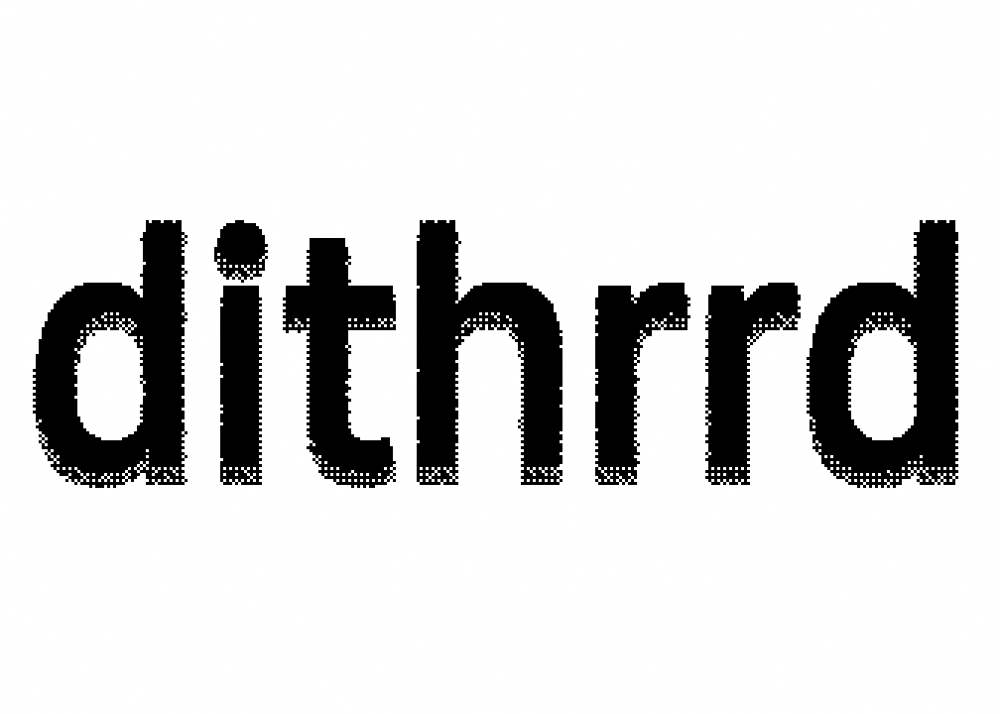
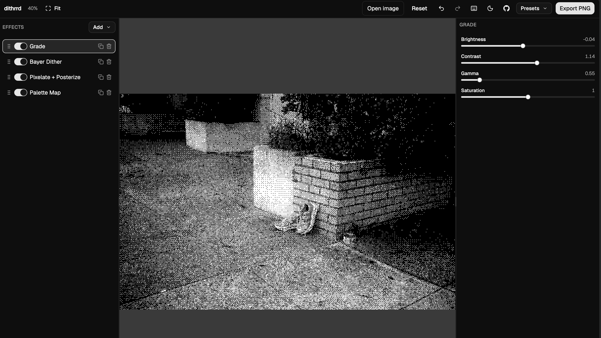

<p align="center">
  
</p>

<p align="center">A browser-based photo dithering and halftone customizer.</p>

dithrrd loads an image in your browser, runs it through a stack of dithering, halftone,
and color effects, and lets you tune every parameter live before exporting a PNG. Nothing
gets uploaded anywhere: decode, render, and export all happen locally, on the GPU via
WebGL2, with a CPU Web Worker for the error-diffusion algorithms since those are
inherently sequential. It's for anyone who wants exact, repeatable control over a dithered
look, whether that means 1-bit and Game Boy palettes, print-style halftone screens,
CMYK-ish per-channel rosettes, or some stack of all of the above.



## Features

- **Effect stack.** Add effects, drag to reorder them, toggle a node on or off, duplicate
  it, delete it. The stack is an actual pipeline, where the output of one pass feeds the
  next, so order matters and it's yours to control.
- **16 effects** across five families:
  - *Color*: Grade (brightness/contrast/gamma/saturation), Palette Map, Duotone /
    Multitone.
  - *Pixelate*: Pixelate + Posterize (nearest or average sampling, optional dither before
    quantize).
  - *Ordered*: Bayer Dither (4x4 or 8x8 matrix), Clustered Dot, Per-Channel (CMYK).
  - *Halftone*: Halftone, Line Screen, Crosshatch, all with cell pitch and screen angle.
  - *Error diffusion*: Floyd-Steinberg, Atkinson, Jarvis-Judice-Ninke, Stucki, Sierra,
    Burkes, each with a levels control and optional serpentine scanning.
- **Palettes.** Built-in Black & White, Grayscale 4, and Game Boy palettes, plus a custom
  palette editor: up to 16 swatches, hex entry, reorder, or duplicate a built-in and start
  from there. Custom palettes persist in `localStorage` and export/import as JSON.
- **Eyedropper.** Pick a swatch color straight off the rendered image in the viewport.
- **Presets and shareable links.** Save the current stack (plus any custom palettes it
  references) as a named preset in `localStorage`, export or import it as a JSON file, or
  copy a share link that encodes the whole preset in a `?p=` query parameter. Opening such
  a link applies the preset and strips the parameter from the URL.
- **Undo/redo** over the effect stack and palettes, via zundo, with toolbar buttons and
  keyboard shortcuts.
- **Pan/zoom viewport** with fit-to-viewport, 100%, and incremental zoom, plus a live zoom
  percentage readout.
- **PNG export** of the full-resolution processed image. Source images are downscaled to a
  4096px long edge when opened, and everything downstream works at that size.
- **Light/dark theme**, with a separate Photoshop-style viewport background control
  (checkerboard, white, three grays, black, or a custom hex color) so the backdrop behind a
  transparent image stays independent of the UI theme. Both persist between sessions.
- **Keyboard shortcuts** for the things you do often, listed in an in-app dialog.
- **Resizable, collapsible panels**: stack on the left, controls on the right. The
  collapsed state persists between sessions.

## Requirements

- A modern browser with WebGL2. Without it the app renders a fallback message instead of
  the editor; there is no software rendering path.
- Node.js 20+ for local development (Vite 6 / Vitest 3 toolchain).
- pnpm. This repo is pnpm-only. The version is pinned by the `packageManager` field in
  `package.json`, so with [Corepack](https://nodejs.org/api/corepack.html) enabled
  (`corepack enable`) you get the right pnpm automatically. Don't use npm or yarn; only
  `pnpm-lock.yaml` is tracked.

## Getting started

```sh
git clone git@github.com:narrowstacks/dithrrd.git
cd dithrrd
pnpm install
pnpm dev
```

Vite serves the app at http://localhost:5173 by default, or the next free port if 5173 is
taken. Check the terminal output.

To build and check a production bundle:

```sh
pnpm build     # type-checks with tsc -b, then bundles with Vite into dist/
pnpm preview   # serves dist/ locally
```

## Scripts

| Script | What it does |
| --- | --- |
| `pnpm dev` | Start the Vite dev server with HMR. |
| `pnpm build` | Type-check the project (`tsc -b`), then build the production bundle into `dist/`. |
| `pnpm preview` | Serve the built `dist/` output locally. |
| `pnpm test` | Run the fast unit suite once (Vitest, jsdom, `*.browser.test.ts` excluded). |
| `pnpm test:watch` | Same suite in watch mode. |
| `pnpm test:browser` | Run the browser suite (`src/**/*.browser.test.ts`) in headless Chromium via `vitest.browser.config.ts`, against a real WebGL2 context. |
| `pnpm test:all` | Run the unit suite, then the browser suite. |

`pnpm test:browser` uses Vitest browser mode with the Playwright provider and a single
headless `chromium` instance, so Playwright's browser binaries must be installed first:

```sh
pnpm exec playwright install chromium
```

There is no lint or format script in this repo, and no CI workflow.

## How it works

1. `decodeToWorkingImage` (`src/features/image.ts`) decodes the chosen file with
   `createImageBitmap`, downscales it to a 4096px long edge, and stores the resulting
   `ImageData` in the zustand store.
2. `src/store/store.ts` holds the source image, the effect stack, palettes, selection, and
   UI state. The `stack` + `palettes` slice is wrapped in zundo, which is what makes
   undo/redo work.
3. `planPasses` (`src/engine/planPasses.ts`) turns the stack into an ordered list of
   passes, dropping disabled nodes and unknown effect types.
4. `execute` (`src/engine/execute.ts`) walks those passes against a backend interface. GPU
   effects (`kind: 'gpu'`) are drawn as fullscreen fragment-shader passes ping-ponging
   between two framebuffers on the regl WebGL2 backend (`src/engine/backend.ts`). CPU
   effects, meaning the six error-diffusion algorithms marked `kind: 'cpu'`, are read back
   from the GPU, sent to a Web Worker (`src/worker/dither.worker.ts`) that mutates the RGBA
   buffer in place, and re-uploaded as a texture. The worker is warmed with a 1x1 job at
   startup so the first real render doesn't stall on module compilation and JIT.
5. `execute` returns the final texture without presenting it. `Viewport` presents it to the
   on-screen canvas, which `react-zoom-pan-pinch` wraps for pan/zoom. `exportCurrentPng`
   (`src/features/exportPng.ts`) re-runs the same pipeline, reads the final texture back,
   flips rows (GL readback is bottom-up), and encodes a PNG via a 2D canvas.

Because CPU passes sit inside a GPU pipeline that uploads with `flipY: true`, the diffusion
loops see bottom-up rows. That's deliberate, and it's consistent between preview, export,
and the golden fixtures. See `fixtures/README.md` if you ever port these effects elsewhere.

## Project layout

```
src/
  App.tsx           Top-level wiring: shortcuts, upload, export, ?p= preset links
  color/            Palette definitions, nearest-color search, hex <-> rgb helpers
  components/ui/    shadcn-style primitives (button, dialog, select, slider, ...)
  effects/          One module per effect (shader or CPU kernel) + the registry
  engine/           WebGL2/regl backend, pass planner, executor, fullscreen quad
  features/         Image decode, PNG export, presets, preset URLs, palette and UI
                    persistence, viewport math
  lib/              Small shared utilities (class-name merge)
  store/            zustand store with zundo temporal history
  testing/          Browser-test harness: golden comparison, PNG codec, test images
  ui/               App shell, toolbar, stack panel, controls, viewport, palette
                    editor, shortcuts
  worker/           Error-diffusion kernels and the Web Worker that runs them
fixtures/           Committed PNG goldens (see fixtures/README.md)
```

## Testing

Two tiers, kept separate because one is fast and the other needs a real GPU.

Unit tests (`pnpm test`, `vitest.config.ts`) run in jsdom on the Node thread pool and cover
the pure logic: effect definitions and uniform mapping, the pass planner, the executor
against a fake backend, diffusion kernels, preset/palette parsing and serialization,
storage helpers, viewport math, shortcut matching, and React component behavior via Testing
Library.

Browser tests (`pnpm test:browser`, `vitest.browser.config.ts`) run in headless Chromium
through Vitest's Playwright provider, against a genuine WebGL2 context. They cover shader
compilation, end-to-end stack rendering, and the golden fixtures.

For the goldens themselves, `src/testing/goldens.ts` renders each effect through the real
pipeline and compares the result to a committed PNG in `fixtures/`, currently 29 images:
one per effect at its defaults, `levels: 3` variants for every effect with a levels param,
an 8x8 Bayer variant, and two multi-effect stacks. Comparison is per-pixel and per-channel.
A pixel is bad if any RGBA channel differs by more than 2, and a golden fails if more than
0.1% of pixels are bad. A dev-server middleware in the browser config serves `fixtures/` so
tests can fetch them. Regenerate deliberately with:

```sh
VITE_UPDATE_GOLDENS=1 pnpm test:browser
```

The goldens were captured on Apple Silicon (ANGLE/Metal) and aren't guaranteed bit-stable
across GPU vendors. `fixtures/README.md` documents the tolerances, the bottom-up scan
order, and why this suite isn't wired into CI.

## Keyboard shortcuts

Single-key shortcuts are ignored while a text field is focused or a dialog/menu is open. On
non-Mac platforms, `⌘` below is `Ctrl`.

| Shortcut | Action | Group |
| --- | --- | --- |
| `⌘Z` | Undo | Edit |
| `⌘⇧Z` (or `⌘Y`) | Redo | Edit |
| `Delete` / `Backspace` | Delete selected node | Stack |
| `⌘D` | Duplicate selected node | Stack |
| `E` | Toggle selected node on/off | Stack |
| `↑` | Select previous node | Stack |
| `↓` | Select next node | Stack |
| `A` | Open the add-effect menu | Stack |
| `⌘E` | Export PNG | File |
| `[` | Collapse/expand the left panel | View |
| `]` | Collapse/expand the right panel | View |
| `+` / `=` | Zoom in | View |
| `-` / `_` | Zoom out | View |
| `0` | Fit to viewport | View |
| `1` | Zoom to 100% | View |
| `?` | Show the keyboard shortcuts dialog | Help |

## License

[MIT](LICENSE)
